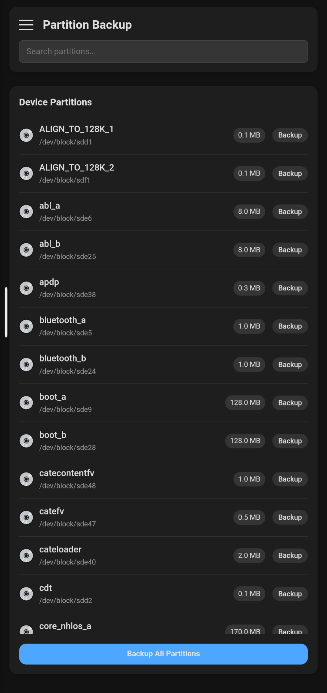
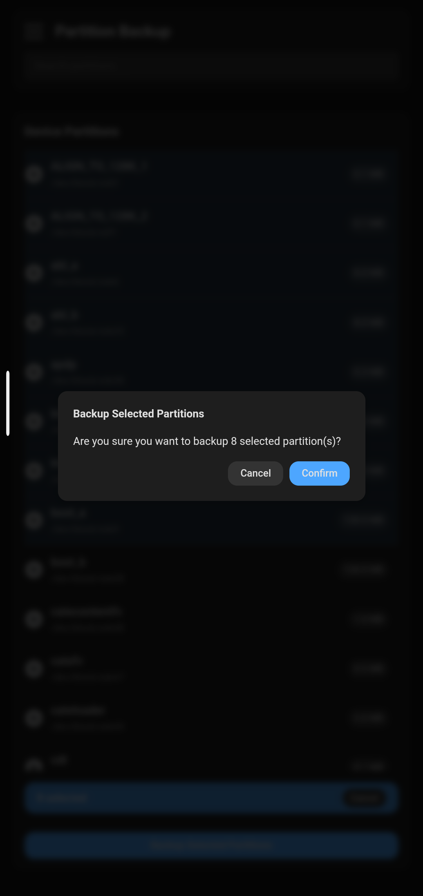
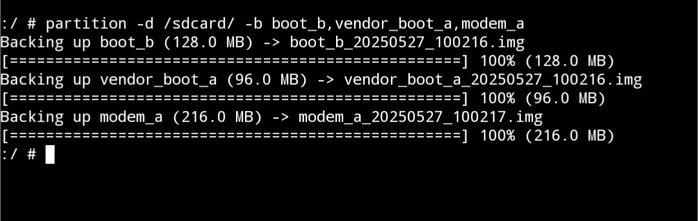

# Partition Backup
- This Utility Allows You To Save Android Device Partition


## Requirements
- Rooted Android Device

## Usage

- `CLI` and `WebUI` both are supported


-CLI Usage :
```
Usage: partition [OPTIONS]
Options:
  -b, --backup PARTITIONS     Backup partitions (comma-separated)
  -d, --directory DIR         Backup directory (default: current)
  -l, --list                  List available partitions
  -h, --help                  Show help
```

### Screenshots
- WebUI

  


- CLI


